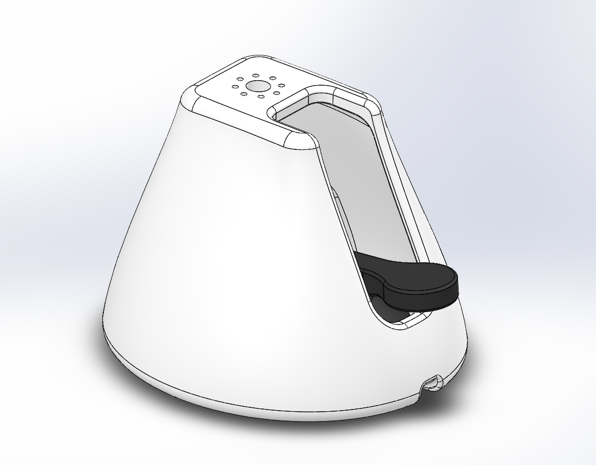

# Robot support toolbox

This repository is dedicated to the development of multi-purpose mechanical parts for fastening and support. In particular, you will find the support used on [Poppy Torso](https://github.com/poppy-project/poppy-torso) to fix it on a table with a suction pad.

## License

All the technological development work made in the Poppy project is freely available under open source licenses. Only the name usage *"Poppy"* is restricted and protected as an international trademark, please contact us if you want to use it or have more information.

|   License     |     Hardware    |   Software      |
| ------------- | :-------------: | :-------------: |
| Title  | [Creatives Commons BY-SA](http://creativecommons.org/licenses/by-sa/4.0/)  |[GPL v3](http://www.gnu.org/licenses/gpl.html)  |
| Logo  |   |  |

**Please keep references to the [Poppy project (www.poppy-project.org)](https://www.poppy-project.org/) when you use or fork this work.**

## Support
You need support ?
The [Poppy forum](https://forum.poppy-project.org) is the best (and single) place to ask for help !
